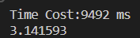
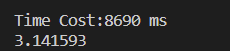
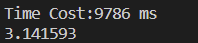
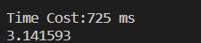
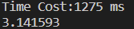
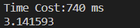
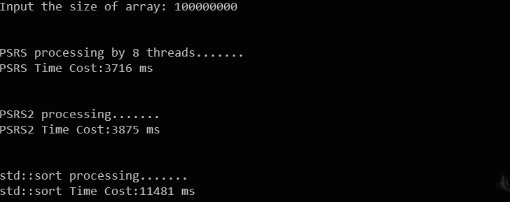

# Report

> 王润泽 PB20020480
>
> Windows11，OpenMP

OpenMP是一个共享存储并行系统上的应用程序接口。它规范了一系列的编译制导、运行库例程和环境变量。它提供了C/C++和FORTRAN等的应用编程接口，已经应用到UNIX、Windows NT等多种平台上。OpenMP使用FORK-JOIN并行执行模型。所有的OpenMP程序开始于一个单独的主线程（Master Thread）。主线程会一直串行地执行，直到遇到第一个并行域（Parallel Region）才开始并行执行。

- FORK：主线程创建一队并行的线程，然后，并行域中的代码在不同的线程队中并行执行；

- JOIN：当诸线程在并行域中执行完之后，它们或被同步或被中断，最后只有主线程在执行。

**可以理解为线程级并行**，每个线程有共享内存与独立内存 。

## 1. $\pi$ 的计算

### 1.1算法介绍 

 $\pi$ 的数值计算方法是利用积分函数近似，即
$$
\int_0^1\frac{1}{1+x^2}dx = \frac{\pi}4
$$
在计算机中则是利用了离散求和的方式求积分,j假设将积分区间划分 $N$ 份，每段步长为 $\Delta=\frac{1}N$
$$
\int_0^1f(x)dx \approx \sum_{i=0}^{N-1}\Delta f[(i-0.5)*\Delta]
$$
串行算法实现则很简单

```cpp
static long num_steps = 1000000000
int i;
double x, pi, sum = 0.0;
step = 1.0/(double)num_steps;
for(i=1;i<= num_steps;i++){
	x = (i-0.5)*step;
	sum=sum+4.0/(1.0+x*x);
}
pi=step*sum;
```

**结果**



### 1.2 并行算法

使用`NUM_THREADS=8`个线程并行实现上面的算法

#### 并行域并行化

共8个线程参加计算，其中线程0进行迭代步0,8,16,...线程1进行迭代步1,9,17,....

```cpp
double x, pi, sum[NUM_THREADS];
#pragma omp parallel private(i)        // 并行域开始，每个线程(0和1)都会执行该代码
    {
        double x;
        int id;
        id = omp_get_thread_num();
        for (i = id, sum[id] = 0.0; i < num_steps; i = i + NUM_THREADS) {
            x = (i + 0.5) * step;
            sum[id] += 4.0 / (1.0 + x * x);
        }
    }
    for (i = 0, pi = 0.0; i < NUM_THREADS; i++)
        pi += sum[i] * step;
```

**结果：**



结果并不如串行的好，问题在于 ` sum[id] += 4.0 / (1.0 + x * x);`处，由于数组 `sum` 内存域的连续性，导致会存在一次性锁64字节cache的问题，所以并没有很好的实现并行化

#### 共享任务结构并行化

共8个线程参加计算，其中线程0进行迭代步0 ~ $0\sim N/8-1$，线程1进行迭代步 $N/8\sim N/8*2-1$....

```cpp
double x, pi, sum[NUM_THREADS];
#pragma omp parallel
    {
        double x;
        int id;
        id = omp_get_thread_num();
        sum[id] = 0;
#pragma omp for  // 未指定chunk，迭代平均分配给各线程（0和1），连续划分
        for (i = 0; i < num_steps; i++) {
            x = (i + 0.5) * step;
            sum[id] += 4.0 / (1.0 + x * x);
        }
    }
    for (i = 0, pi = 0.0; i < NUM_THREADS; i++)
        pi += sum[i] * step;
```

和并行域并行化一样，由于数组 `sum` 内存域的连续性，导致会存在一次性锁64字节cache的问题，所以并没有很好的实现并行化



#### 使用private子句和critical部分并行化

假如共2个线程参加计算，其中线程0进行迭代步0,2,4,...线程1进行迭代步1,3,5,....当被指定为critical的代码段 正在被0线程执行时，1线程的执行也到达该代码段，则它将被阻塞知道0线程退出临界区

PPT提供的代码中存在一些问题，没有私有化 `i`，导致存在数据读写冲突的问题，改正后的代码为

```cpp
    int i;
    double pi = 0.0;
    double sum = 0.0;
    double x = 0.0;
    step = 1.0 / (double)num_steps;
    omp_set_num_threads(NUM_THREADS);  // 设置线程
#pragma omp parallel private(i,x, sum)   // 该子句表示i,x,sum变量对于每个线程是私有的,性能更好
    {
        int id;
        id = omp_get_thread_num();
        for (i = id, sum = 0.0; i < num_steps; i = i + NUM_THREADS) {
            x = (i + 0.5) * step;
            sum += 4.0 / (1.0 + x * x);
        }
#pragma omp critical  // 指定代码段在同一时刻只能由一个线程进行执行
        pi += sum * step;
    }
```

使用这种办法就解决了锁64字节cache的问题

**结果**



#### 并行规约

利用封装好的加法规约进行计算，每个线程保留一份私有拷贝sum，x为线程私有，最后对线程中所以sum进行+规约，并更新sum的全局值。这样也可以解决锁内存问题。

```cpp
#pragma omp parallel for reduction(+ : sum) private(x)
    for (i = 1; i <= num_steps; i++) {
        x = (i - 0.5) * step;
        sum += 4.0 / (1.0 + x * x);
    }
    pi = sum * step;
```

**结果**



### 1.3 改变存储结构

为了解决cache冲突问题，也可以通过修改读取数组的数据结构使得每次进行读取数据时，避免出现两个线程读写位置近邻了情况，修正方式是将 `double sum[NUM_THREADS]` 改正为 `double sum[NUM_THREADS][8]`

```cpp
   	int i;
    double x, pi;
	double sum[NUM_THREADS][8]; // 64字节对齐
    step = 1.0 / (double)num_steps;
    omp_set_num_threads(NUM_THREADS);  // 设置2线程

#pragma omp parallel private(i)        // 并行域开始，每个线程(0和1)都会执行该代码
    {
        double x;
        int id;
        id = omp_get_thread_num();
        for (i = id, sum[id] = 0.0; i < num_steps; i = i + NUM_THREADS) {
            x = (i + 0.5) * step;
			sum[id][0] += 4.0 / (1.0 + x * x);
        }
    }
    for (i = 0, pi = 0.0; i < NUM_THREADS; i++){
		pi += sum[i][0] * step;
	}
```

**结果**



和使用private子句和critical部分并行化结果一直，但是有空间浪费的问题

## 2. PSRS实现

PSRS算法是利用并行的方法处理均匀分布数组的排序问题

### 2.1 算法介绍

MIMD-SM模型上的PSRS排序

```cpp
(1)均匀划分：将n个元素A[1..n]均匀划分成p段，每个pi处理 A[(i-1)n/p+1..in/p]
(2)局部排序：pi调用串行排序算法对A[(i-1)n/p+1..in/p]排序
(3)选取样本：pi从其有序子序列A[(i-1)n/p+1..in/p]中选取p个样本元素
(4)样本排序：用一台处理器对p2个样本元素进行串行排序
(5)选择主元：用一台处理器从排好序的样本序列中选取p-1个主元，并播送给其他pi
(6)主元划分：pi按主元将有序段A[(i-1)n/p+1..in/p]划分成p段
(7)全局交换：各处理器将其有序段按段号交换到对应的处理器中
(8)归并排序：各处理器对接收到的元素进行归并排序
```

### 2.2 并行实现

在实现细节上主要是在第（7）步中全局交换的部分，由于初始数据是随机分布的，不可避免的在全局交换时，不同线程在第（8）步排序的元素数目不等，虽然差别不大，但在代码实现时要记录好每个主元在第（2）步局部排序后的数组内划分点，辅助第（7）步的全局交换

故引入了几个数组

- `divide[NUM_THREADS][NUM_THREADS]` 用来存储每个局部数组中主元所在位置
- `len[NUM_THREADS][8]` 主要是在 `len[i][0]` 中预备存储好第（8）步中每个线程待排数据个数
- `offset[NUM_THREADS]` 用来记录每个线程待排数据的 `start` 和 `end` 在 `data` 原始数组的位置

代码如下：

```cpp
void PSRS(std::vector<int>& data) {
    int n = data.size();
    int i, j;
    omp_set_num_threads(NUM_THREADS);  // 设置线程
    std::vector<int> sample_data(NUM_THREADS * NUM_THREADS);
    std::vector<int> backup(n);
    int pivot[NUM_THREADS - 1];
    int step = n / NUM_THREADS / NUM_THREADS;
    int divide[NUM_THREADS][NUM_THREADS];
    int len[NUM_THREADS][8];
    int offset[NUM_THREADS];
    int start, end, id;
#pragma omp parallel private(i, j,id, start, end)  				// 局部排序
    {
        id = omp_get_thread_num();
        start = (id)*n / NUM_THREADS;
        end = id == (NUM_THREADS - 1) ? n : (id + 1) * n / NUM_THREADS;
        std::sort(data.begin() + start, data.begin() + end);
        for (i = 0; i < NUM_THREADS; i++)  						// 正则采样
            sample_data[id * NUM_THREADS + i] = data[start + i * step];
        std::copy(data.begin() + start, data.begin() + end, backup.begin() + start);
#pragma omp barrier//同步障
#pragma omp master
        {
            std::sort(sample_data.begin(), sample_data.end());  // 采样排序
            for (i = 0; i < NUM_THREADS - 1; i++)	            // 选取主元
                pivot[i] = sample_data[(i + 1) * NUM_THREADS];
        }
#pragma omp barrier //同步障
        //分割
        id = omp_get_thread_num();
        for (i = 0,j = start; i < NUM_THREADS - 1; i++) {
            while(data[j]<pivot[i]&&j<end)
                j++;
            divide[id][i] = j;
        }
        divide[id][NUM_THREADS - 1] = end;
#pragma omp barrier //同步障
        // 计算长度
        len[id][0] = 0;
        for (i = 0; i < NUM_THREADS; i++) {
            auto s = (i)*n / NUM_THREADS;
            len[id][0] += divide[i][id] - (id == 0 ? s : divide[i][id - 1]);
        }
#pragma omp barrier //同步障
#pragma omp master // 计算偏移量 与 备份
        {
            for (i = 0; i < NUM_THREADS; i++)
                offset[i] = i == 0 ? 0 : offset[i - 1] + len[i - 1][0];
        }
#pragma omp barrier
        // 全局交换
        start = offset[id];
        end = id == NUM_THREADS - 1 ? n : offset[id + 1];
        for (i = 0; i < NUM_THREADS; i++) {
            int divide_start = id == 0 ? (i)*n / NUM_THREADS : divide[i][id - 1];
            int divide_end = divide[i][id];
            for (j = divide_start; j < divide_end && start < end; j++, start++) 
                data[start] = backup[j];
        }
        // 再次局部排序
        start = offset[id];
        std::sort(data.begin() + start, data.begin() + end);
    }
}	
```

### 2.3 结果对比

上面的算法是在并行域中显式地使用了同步障 `#pragma omp barrier`，也可以不使用同步障，而是单独划分平行域，代码实现见 `void PSRS2(std::vector<int>& data)` 函数，最后在8个线程下与标准快排进行对比，下面排序了 `1e8` 个均匀随机分布的整数，整数大小在 $0-99$ 范围



从结果可以看到，并行的算法效率明显提高，而且显式地使用好同步障，可以略微使算法得到加速

## 3. Summary

- 本次实验熟悉了 OpenMP 的并行编程方法
- 使用 OpenMP 实现了 $\pi $ 数值计算和 **PSRS** 算法，
- 比较了并行与串行的结果，并得到并行加速的效果
- 对线程级共享存储与独立存储结构有了更加深刻的认识