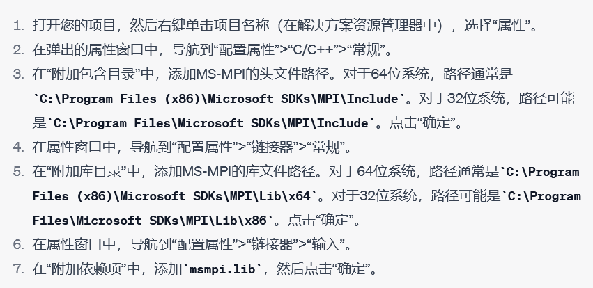

# 环境配置

##### 在visual studio中手动配置

Windows下环境配置（visual studio）：

安装压缩包内提供的.exe和.msi两个安装包。

VS菜单栏项目选项，点开属性，在下方界面修改包含目录和库目录两项，分别加入Include和Lib （64位机器用x64，否则用x86）



Debug模式下生成.exe文件，进入其所在的目录x64/Debug或x86/Debug 运行

```
mpiexec –n 4 *.exe
```

##### 利用Cmake 配置

```cmake
cmake_minimum_required(VERSION 3.10)

project(mpi_project)

# 寻找MPI库
find_package(MPI REQUIRED)

# 将MPI_INCLUDE_PATH添加到包含目录
include_directories(${MPI_INCLUDE_PATH})

# 创建一个名为my_mpi_program的可执行文件，将main.cpp编译为可执行文件
add_executable(pi_program src/main.cpp)

# 将MPI库链接到可执行文件
target_link_libraries(pi_program ${MPI_LIBRARIES})

# 如果需要的话，处理MPI的编译器包装器特定的编译和链接标志
if(MPI_COMPILE_FLAGS)
  set_target_properties(pi_program PROPERTIES
    COMPILE_FLAGS "${MPI_COMPILE_FLAGS}")
endif()

if(MPI_LINK_FLAGS)
  set_target_properties(pi_program PROPERTIES
    LINK_FLAGS "${MPI_LINK_FLAGS}")
endif()
```

### 多进程编程

```sh
mpicc demo.c –o demo
mpirun -np 4 ./demo
mpiexec –n 4 ./demo
```

> 如果是C++，Windows系统目前好像只能用visual studio IDE来运行
>

# MPI通信

在MPI中，阻塞和非阻塞通信是两种不同类型的通信方式，它们在消息发送和接收的行为上有所不同。

1. 阻塞通信：

阻塞通信是指在消息发送或接收完成之前，发送或接收函数会一直等待，不允许执行其他操作。这意味着在函数返回之前，相关的发送或接收缓冲区不能用于其他操作。阻塞通信的主要优点是简单易用，但它可能导致性能下降，因为进程可能会花费大量时间等待通信完成。

阻塞通信的典型函数包括：

- MPI_Send：发送消息的阻塞函数。
- MPI_Recv：接收消息的阻塞函数。

2. 非阻塞通信：

非阻塞通信是指发送或接收函数在消息传输尚未完成时就可以立即返回。这意味着进程可以继续执行其他任务，而不必等待通信完成。非阻塞通信的优点是可以提高并行性能，因为它允许进程在通信期间执行其他计算任务。然而，非阻塞通信需要更复杂的编程，因为需要确保通信在使用相关缓冲区之前已经完成。

非阻塞通信的典型函数包括：

- MPI_Isend：发送消息的非阻塞函数。
- MPI_Irecv：接收消息的非阻塞函数。

为了检查非阻塞通信是否完成，需要使用MPI_Wait或MPI_Test函数：

- MPI_Wait：等待指定的非阻塞操作完成。
- MPI_Test：检查指定的非阻塞操作是否已完成，如果已完成，则返回true，否则返回false。

总结一下，阻塞通信和非阻塞通信的主要区别在于：

- 阻塞通信在通信完成之前不允许进行其他操作，而非阻塞通信允许在通信进行时执行其他任务。
- 阻塞通信编程简单，但可能导致性能下降；非阻塞通信可以提高性能，但编程更复杂。

### MPI_Bcast

MPI_Bcast是MPI中的一个广播函数，用于将一个进程的数据发送给所有其他进程。具体来说，MPI_Bcast的作用是将一个缓冲区中的数据广播到所有的进程中，这样每个进程都可以得到相同的数据（buff）。MPI_Bcast的函数原型如下：

```cpp
int MPI_Bcast(void* buffer, int count, MPI_Datatype datatype, int root, MPI_Comm comm)
```

其中，参数含义如下：

- buffer：要广播的缓冲区的地址。
- count：要广播的缓冲区中元素的数量。
- datatype：要广播的缓冲区中元素的数据类型。
- root：广播的根进程的排名，即数据的来源进程。
- comm：通信子，确定广播操作的进程组。

在MPI_Bcast函数中，root进程是广播的源头，也是第一个向缓冲区中写入数据的进程。其他进程会从root进程接收数据，并将其存储到各自的缓冲区中。MPI_Bcast函数是一个阻塞函数，即调用该函数的进程会一直等待，直到所有进程都完成广播操作为止。