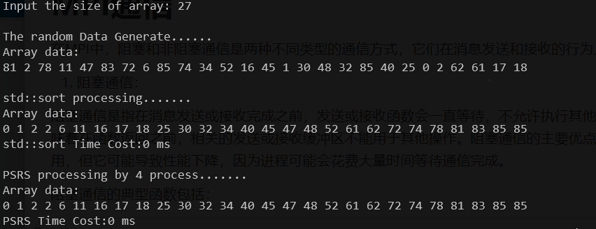
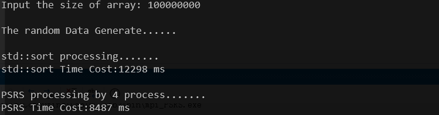
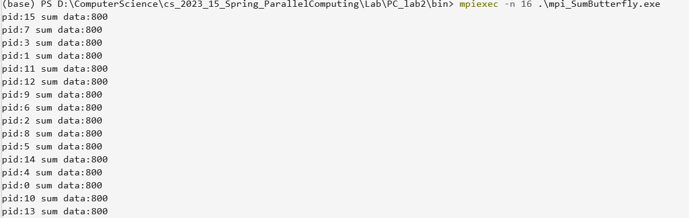
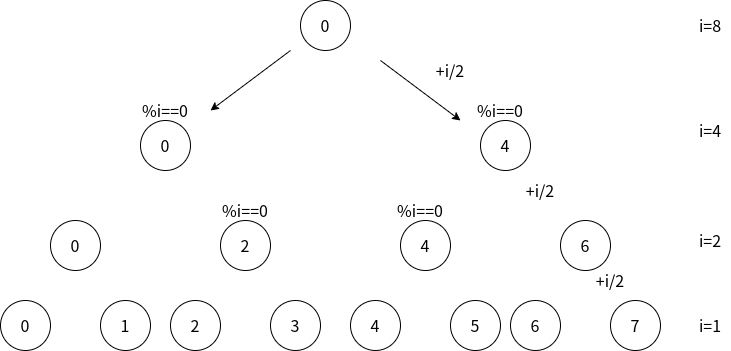
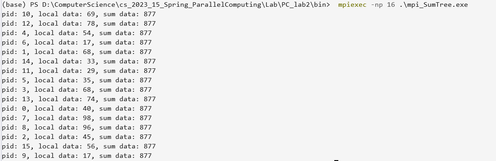

# Report

> 王润泽 PB20020480
>
> Windows11，MPI

**MPI（Message Passing Interface）**是目前最重要的一个基于消息传递的并行编程工具，它具有移植性好、功能强大、效率高等许多优点，而且有多种不同的免费、高效、实用的实现版本，几乎所有的并行计算机厂商都提供对它的支持，成为了事实上的并行编程标准。

MPI是一个库，而不是一门语言，因此对MPI的使用必须和特定的语言结合起来进行。MPI不是一个独立的自包含系统，而是建立在本地并行程序设计环境之上，其进程管理和I/O均由本地并行程序设计环境提供。

**可以理解为进程级并行**，进程间需要消息传递来共享处理数据

## 1. PSRS排序

PSRS算法是利用并行的方法处理均匀分布数组的排序问题

### 1.1 算法介绍

MIMD-SM模型上的PSRS排序

```cpp
(1)均匀划分：将n个元素A[1..n]均匀划分成p段，每个pi处理 A[(i-1)n/p+1..in/p]
(2)局部排序：pi调用串行排序算法对A[(i-1)n/p+1..in/p]排序
(3)选取样本：pi从其有序子序列A[(i-1)n/p+1..in/p]中选取p个样本元素
(4)样本排序：用一台处理器对p2个样本元素进行串行排序
(5)选择主元：用一台处理器从排好序的样本序列中选取p-1个主元，并播送给其他pi
(6)主元划分：pi按主元将有序段A[(i-1)n/p+1..in/p]划分成p段
(7)全局交换：各处理器将其有序段按段号交换到对应的处理器中
(8)归并排序：各处理器对接收到的元素进行归并排序
```

### 1.2 并行实现

在代码实现中，为了方便进行（1）-（5）的消息传播，应当尽量让数据划分均匀，所以在处理待排序数据时，根据进程数的整数倍，来将数组补齐

```cpp
 	%nz是输入数组大小
 	n_extra = nz % pNum == 0 ? 0 : pNum - nz % pNum;
    size = (nz+n_extra) / pNum;
    n = size * pNum;
    if (pid == 0) 
        rawdata.resize(n+n_extra);
    local_data.resize(size);
    if (pid < pNum - 1) 
        for (int i = 0; i < size; i++)
            local_data[i] = distribution(generator);
    else {
        for (int i = 0; i < size - n_extra; i++)
            local_data[i] = distribution(generator);
        if(n_extra>0)//处理不均匀数组
            for(int i=size-n_extra;i<size;i++)
			    local_data[i] = INF;
    }
    MPI_Gather(local_data.data(), size, MPI_INT, rawdata.data(), size, MPI_INT, 0, MPI_COMM_WORLD);
```

在算法细节上主要是在第（7）步中全局交换的部分，由于初始数据是随机分布的，不可避免的在全局交换时，不同线程在第（8）步排序的元素数目不等，虽然差别不大，但在代码实现时要记录好每个主元在第（2）步局部排序后的数组内划分点，辅助第（7）步的全局交换

故引入了几个数组

- `divide[NUM_THREADS][NUM_THREADS]` 用来存储每个局部数组中主元所在位置
- `len[NUM_THREADS]` 主要是在 `len[i]` 中预备存储好第（8）步中每个线程待排数据个数
- `offset[NUM_THREADS]` 用来记录每个线程待排数据的 `start` 和 `end` 在 `data` 原始数组的位置

注意在第（7）全局交换并且归并排序时，可能会有数组数据大小不一致的问题，故上面设计的数组就可以发挥作用了

```cpp
   	%（8）局部再次归并排序
   	std::sort(local_data.begin(), local_data.end());
    size = local_data.size();
    MPI_Gather(&size, 1, MPI_INT, len.data(), 1, MPI_INT, 0, MPI_COMM_WORLD);
    //根进程收集数据
    if (pid == 0) {
        offset[0] = 0;
        for (i = 1; i < pNum; i++) {
            offset[i] = offset[i - 1] + len[i - 1];
        }
    }
    // 使用MPI_Gatherv收集不同大小的数组
    MPI_Gatherv(local_data.data(), local_data.size(), MPI_INT, data.data(), len.data(), offset.data(), MPI_INT, 0, MPI_COMM_WORLD);
    
```

其他的代码实现细节见文件 `PSRS.cpp`

### 1.3 结果对比

在输入数据较少时，可以查看对比结果：




在4个进程程下与标准快排进行对比，下面排序了 `1e8` 个均匀随机分布的整数，整数大小在 $0-99$ 范围



## 2 求全和

N个进程求N个数的全和，要求每个处理器均保持全和

### 2.1 碟式全和


在第一阶段，每个处理器与其相邻的处理器交换它们的数据。注意一下它们的编号：`Proc#0` 和 `Proc#1` ，`Proc#2` 和 `Proc#3`，……如果我们把这些编号全部写成二进制，规律就更加明显了 。这些互相交流的处理器的编号，除了倒数第一位是不一致的，其他都是一致的！

第二个阶段，处理器0与2号处理器交流，1号与3号交流，4号与6号交流……在二进制表示中，也是只有一个位的差别，这里是倒数第二位。第三阶段，0号处理器与4号交流，是倒数第三位的差别。

得到规律：在第 `i` 个阶段，处理器 `Proc#n` 会与处理器 `Proc#(n ^ (1 << (i-1)))` 交换数据（发送和接收都要），然后相加就行了，其中用到了异或的性质
$$
A = A\oplus B\oplus B
$$
保证了两个节点间的相互传输

故有下面的代码实现

```cpp
	int pid, pNum;
	int data;
	int recvdata;
	MPI_Status status;
	MPI_Init(NULL, NULL);
	MPI_Comm_size(MPI_COMM_WORLD, &pNum);
	MPI_Comm_rank(MPI_COMM_WORLD, &pid);
	// 创建一个随机数生成器对象，使用当前时间作为种子
	std::default_random_engine generator(std::chrono::system_clock::now().time_since_epoch().count());
	// 创建一个均匀分布的整数分布器，范围为[0, 99]
	std::uniform_int_distribution<int> distribution(0, 99);
	data = distribution(generator);
	int dest;
	for (int i = 1; i < pNum; i = i << 1) {
		//按位异或找邻居，比如i=2, 那么0的邻居是2，用到了异或的性质：a^b^b=a；
		//其实也可以通过pid % (i >> 1) == 0来找
		dest = pid ^ i;
		MPI_Send(&data, 1, MPI_INT, dest, i, MPI_COMM_WORLD);
		MPI_Recv(&recvdata, 1, MPI_INT, dest, i, MPI_COMM_WORLD, &status);
		data += recvdata;
	}
```

结果如下：



### 2.2 二叉树求和


与碟式求和不同的是，向上传播时迭代的结点在减少，向下传播时，迭代的结点在增多。即先将相邻的处理器数据收集起来，求和后再次重复，直到求出总和，最后沿着二叉树的路径将求和结果往下传导。

比如，在第一个阶段，0号处理器与1号处理器相加，`Proc#2` 与 `Proc#3`  相加，假设求和后的数据都存放在较小编号的处理器中，那么第二阶段，就是 `Proc#0` 与 `Proc#2`  相加，第三阶段（如果有的话），就是 `Proc#0` 与`Proc#4`  相加。同样从二进制入手，找到如下规律：**在第 `i` 个阶段，相互之间通信的处理器中仅第 `i` 位不一致，用按位与处理。**还需要注意的是，编号较小的处理器接收数据，较大的发送数据。

**设置一个flag标识该结点将不再参与传播**

```cpp
	//gather
	for (int i = 1,flag=1; i < pNum&&flag; i = i << 1) {//i是每层相邻结点差值
		int tag = i;
		int diff = pid & tag;//按位与得到父节点
		int dest = pid ^ tag;//按位异或得到相邻传输结点
		if (diff) {
			MPI_Send(&data, 1, MPI_INT, dest, tag, MPI_COMM_WORLD);
			flag = 0;
		}
		else {
			MPI_Recv(&recvdata, 1, MPI_INT, dest, tag, MPI_COMM_WORLD, &status);
			data += recvdata;
		}
	}
	MPI_Barrier(MPI_COMM_WORLD);
```

然后就是将 `Proc#0` 处理器中的计算结果分发给其他处理器。需要弄清楚两点：哪一个处理器接收？哪一个处理器发送？第一步，当然是 `Proc#0` 处理器发送，让 `Proc#N/2` 处理器接收。第二步，`Proc#0` 与 `Proc#N/4` 通信，`Proc#N/2`与 `Proc#3N/4` 通信，每次发送/接收消息，处理器编号的差都是 *i*/2，而且只有编号是 i 的倍数的处理器才能发送消息。把循环变量当做处理器总数，并每次除 2，可以方便我们对处理器编号的计算



```cpp
	for (int i = pNum; i >= 2; i = i >> 1) {
		int tag = i;
		int dest  = pid ^ (i >> 1);//按位异或得到相邻传输结点 
		if (pid % i == 0) {
			MPI_Send(&data,1, MPI_INT, dest, tag, MPI_COMM_WORLD);
		}
		else if (pid % (i >> 1) == 0) {//如果当前是没有传到的
			MPI_Recv(&data, 1, MPI_INT, dest, tag, MPI_COMM_WORLD, &status);
		}
	}
```

结果如下



## 3. Summary

- 本次实验熟悉了 MPI 的并行编程方法
- 使用 OpenMP 实现了 **PSRS** 算法和各个处理器求全和算法
- 比较了并行与串行的结果，并得到并行加速的效果
- 对进程级基于消息传递的并行编程工具有了更加深刻的理解