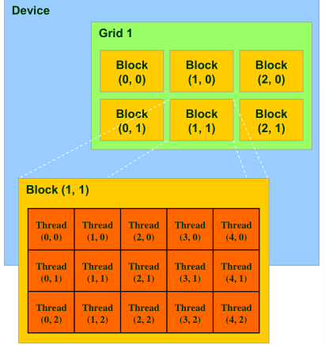
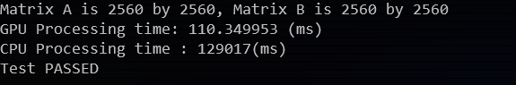

# Report

> 王润泽 PB20020480
>
> Windows11, CUDA 12.1

CUDA（Compute Unified Device Architecture）是一种由NVIDIA开发的并行计算平台和编程模型。它允许开发人员使用标准C或C++语言来编写程序，利用NVIDIA GPU（图形处理器）进行高性能的通用计算。

CUDA的主要目标是利用GPU的并行计算能力，加速各种计算密集型任务，包括科学计算、数据分析、图形渲染、深度学习等。相对于传统的CPU，GPU在处理大规模并行任务时具有显著的优势，因为GPU具有大量的计算单元和高内存带宽，能够同时执行大量的计算任务。

CUDA编程模型基于两个关键概念：主机（Host）和设备（Device）。主机是指主CPU，设备则是指GPU。在CUDA中，开发者可以将任务分为主机端的代码和设备端的代码。主机端的代码负责管理和调度任务，而设备端的代码则在GPU上执行实际的计算任务。

**GPU** 并行，基本执行单元是 **线程**，所有线程执行相同的代码（STMD），其存储结构如下



- 若干线程可以组成块(Block，每个块至多512个线程)，线程块可以呈一维、二维或者三
  维结构，每个线程块分为若干个组(称为warp)，每个warp包含32个线程，物理上以SIMD方式并行
- 若干个线程块可以组织成网格grid

在每个线程代码中，用来唯一表示线程id

```c++
int blockId = blockIdx.x + blockIdx.y * gridDim.x;
int threadId = blockId * (blockDim.x * blockDim.y) + (threadIdx.y * blockDim.x) + threadIdx.x;
```

## 1. 向量加法

### 1.1 Assignment

定义A,B两个一维数组，编写GPU程序将A和B对应项相加，将结果保存在数组C中。分别测试数组规模为10W、20W、100W、200W、1000W、2000W时其与CPU加法的运行时间之比

### 1.2 Experiment

无论是什么cuda程序，都包含以下算法流程

```cpp
Main(){ //主函数
    float *Md;
    cudaMalloc((void**)&Md, size); //在GPU上分配空间
    //从CPU复制数据到GPU
    cudaMemcpy(Md, M, size, cudaMemcpyHostToDevice);
    //调用内核函数
    kernel<<<dimGrid, dimBlock>>> (arguments);
    //从GPU将结果复制回CPU
    CopyFromDeviceMatrix(M, Md);
    FreeDeviceMatrix(Md);//释放GPU上分配的空间
}
```

对于向量加法程序同理，主要关注的是与 CPU 加法进行比较，本次实验中采取的策略是固定 **Block** 中线程数目，而动态调整 **Block** 的个数，这样可以随着向量规模的增大而增大线程个数

```c++
#define THREAD_NUM 512
int new_block_num = std::min(65535, (size + THREAD_NUM - 1) / THREAD_NUM);

__global__ void vectorAddOnKernel(float*c, float*a, float* b,unsigned int size) {
	int tid = threadIdx.x + blockIdx.x * blockDim.x;
	while (tid < size) {
		c[tid] = a[tid] + b[tid];
		tid += blockDim.x * gridDim.x;
	}
}

int main(){
.....
	vectorAddOnKernel <<<new_block_num, THREAD_NUM >>> (dev_c, dev_a, dev_b, size);
.....
}
```

### 1.3 Result

测试完后，代码结果如下


## 2. 矩阵乘法

### 2.1 Assignment

定义A，B 两个二维数组。使用GPU 实现矩阵乘法。并对比串行程序，给出加速比。

### 2.2 Experiment

代码框架同上，不同的地方在于为矩阵定义了 $G*G$ 的二维 Blocks存储在grid中，一个 Block 的大小是 $16*16$ 的矩阵块，在设备上进行矩阵乘法时，利用共享存储器来加速并行代码，使得每次运算都是以线程块为单位进行，避免了数据传输的瓶颈

```cpp
_global__ void matrixMulKernel(float* C, float* A, float* B, int wA, int wB) {
    // Declaration of the shared memory array As used to
    //store the sub-matrix of A
    // 同一个线程块内的线程共享内存
    __shared__ float As[BLOCK_WIDTH][BLOCK_WIDTH];
    __shared__ float Bs[BLOCK_WIDTH][BLOCK_WIDTH];
    // Block index
    int bx = blockIdx.x;
    int by = blockIdx.y;  
    // Thread index，子矩阵内标号
    int tx = threadIdx.x;
    int ty = threadIdx.y;
    // Csub is used to store the element of the block sub-matrix
    // that is computed by the thread
    float Csub = 0;
    for (int m = 0; m < wA / BLOCK_WIDTH; m++) {//wA==hB 子矩阵的个数
        //get the address of submatrixA
        //float *subA=A+wA*BLOCK_WIDTH*by+BLOCK_WIDTH*m;
        float* subA = GetSubMatrix(A, m, by, wA);
        //get the address of submatrixB
        //float *subB=B+wB*BLOCK_WIDTH*m+BLOCK_WIDTH*bx;
        float* subB = GetSubMatrix(B, bx, m, wB);
        //统一线程块给As,Bs赋值
        As[ty][tx] = *(subA + wA * ty + tx);
        Bs[ty][tx] = *(subB + wB * ty + tx);
        //实现同一块内线程同步，实现子矩阵赋值同步
        __syncthreads();//虽然visual stuido报错，但可以运行
        // 计算线程块中tx,ty处对应的元素，
        // Csub是一个局部值，需要外循环结束，遍历A的所有列子矩阵，B的所有行子矩阵，才能得到最终的Csub
        for (int k = 0; k < BLOCK_WIDTH; ++k)
            Csub += As[ty][k] * Bs[k][tx];
        __syncthreads();
    }
    //float *subC = C+wB * BLOCK_WIDTH * by + BLOCK_WIDTH * bx;
    float* subC = GetSubMatrix(C, bx, by, wB);
    *(subC + wB * ty + tx) = Csub;
}
```

### 2.2 Result

与CPU矩阵乘法进行对比，测试了 $2560\times 2560$大小的矩阵乘法，有以下结果



加速比达到100倍

## 3. Summary

本次实验熟悉了CUDA编程环境，对CUDA内存储结构有了清楚的认识，掌握了CUDA编程的算法流程，感受到GPU带来的加速效果